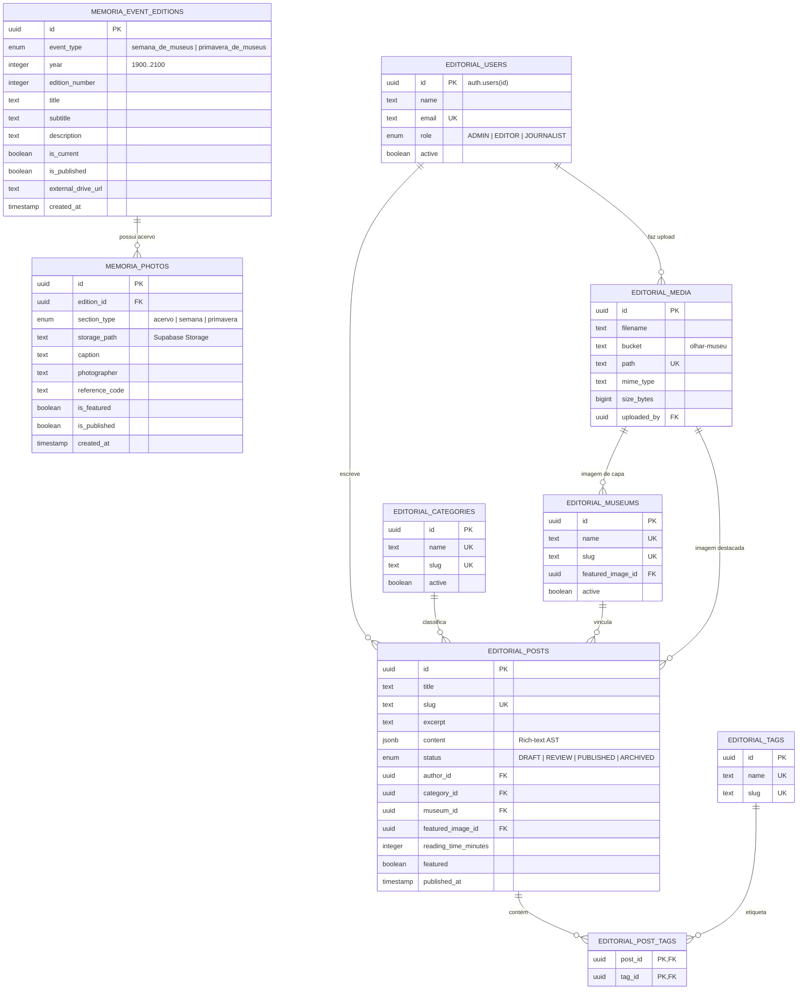

<div align="center">

# 🏛️ SiMOP — Sistema de Museus de Ouro Preto

**Plataforma digital integrada de salvaguarda, memória histórica, curadoria editorial e difusão das instituições museais de Ouro Preto, Minas Gerais.**

[](https://nextjs.org/)
[](https://react.dev/)
[](https://www.typescriptlang.org/)
[](https://tailwindcss.com/)
[](https://supabase.com/)
[](https://vercel.com/)
[](https://opensource.org/licenses/MIT)

[Acessar Aplicação](https://simop-flax.vercel.app/) • [Estrutura do Banco](#-arquitetura-do-banco-de-dados) • [Engenharia & Arquitetura](#-arquitetura-e-engenharia-de-software) • [Instalação](#-instalação-e-execução-local)

</div>

---

## 📌 Sobre o Projeto

Ouro Preto abriga um dos mais expressivos e relevantes conjuntos arquitetônicos e museológicos do barroco e da história do Brasil. O **SIMOP (Sistema de Museus de Ouro Preto)** foi instituído pela **Lei Municipal nº 305/2006** como uma estrutura colegiada e colaborativa para articular, planejar e integrar as atividades de **16 instituições museais** (federais, estaduais, municipais, universitárias e fundacionais).

Este projeto é o **portal oficial e aberto** do sistema. Desenvolvido por uma **equipe multidisciplinar** envolvendo engenheiros de software, pesquisadores, museólogos, historiadores e designers, a plataforma resolve os principais desafios do ecossistema cultural do município:

1. **Centralização do Patrimônio:** Unifica a consulta a acervos, histórias, horários, exposições e contatos das 16 instituições.
2. **Salvaguarda e Memória:** Repositório fotográfico histórico e digitalização documental das grandes temporadas culturais (*Semana de Museus* e *Primavera de Museus*).
3. **Hub Editorial Autônomo:** Publicação digital e difusão das reportagens, ensaios e boletins do projeto *Olhar Museu*.
4. **Governança e Transparência:** Disponibilização pública de estatutos federais, leis municipais e o regimento interno do Conselho Gestor.

> 🌐 **Código Aberto:** O código-fonte deste projeto é aberto e de livre consulta, desenvolvido com as melhores práticas da engenharia de software contemporânea para servir como referência técnica e plataforma de impacto social e cultural.

---

## 🏗️ Arquitetura e Engenharia de Software

O SiMOP foi projetado sob os padrões mais recentes do ecossistema **Next.js (App Router)** com foco em resiliência, escalabilidade e excelente experiência de usuário (Core Web Vitals):

### 1. Server-First & Incremental Static Regeneration (ISR)
A maioria absoluta das páginas é renderizada no servidor (`React Server Components`). As páginas de museus, legislações, publicações e eventos operam com revalidação estática periódica (`export const revalidate = 60`), garantindo carregamento instantâneo para o visitante e indexação impecável para motores de busca (SEO).

### 2. Resiliência por Design: *Graceful Fallback Pattern*
O sistema foi concebido de forma defensiva para operar com **zero quebras**. Caso a instância do banco de dados (Supabase) esteja desconectada, em manutenção ou sem credenciais no ambiente local:
- Os serviços de dados em `src/lib/` interceptam requisições graciosamente;
- Fallbacks estruturados locais mantêm a interface 100% funcional e consistente;
- Nenhuma tela em branco ou crash de renderização é exibido ao usuário final.

### 3. Isolamento Multi-Schema em PostgreSQL
Em vez de misturar dados operacionais e editoriais na mesma tabela pública, o banco de dados é dividido em **esquemas lógicos segregados**:
- **`public`**: Gerencia o histórico das edições anuais e acervo iconográfico do módulo *Memória e Eventos*.
- **`editorial`**: Um CMS desacoplado completo para o jornalismo cultural do *Olhar Museu*, com controle de autores, categorias, mídias, tags e conteúdo rico (`JSONB`).

### 4. Design System Temático & Acessibilidade
Construído com **Tailwind CSS**, o visual mescla componentes táteis em *Claymorphism* sutil com uma paleta histórica nobre inspirada em Ouro Preto:
- `night` (`#161310`): O escuro das pedras seculares de cantaria.
- `gold` (`#C99A45`): O ouro e as talhas barrocas coloniais.
- `ivory` (`#F7F5F0`): O marfim das paredes caiadas e papel de imprensa.
- `stone` (`#E6E1D8`): Os tons terrosos do patrimônio mineiro.

---

## 🗄️ Arquitetura do Banco de Dados

O backend é fundamentado no **Supabase (PostgreSQL 15+)**, utilizando o recurso nativo de schemas para separar responsabilidades de domínio:



### Detalhamento dos Esquemas

| Schema | Tabela | Propósito e Características |
| :--- | :--- | :--- |
| `public` | `memoria_event_editions` | Catálogo das edições anuais dos eventos oficiais com suporte a link para arquivo em nuvem e indicador de edição vigente. |
| `public` | `memoria_photos` | Documentação fotográfica histórica referenciada por caminhos de bucket no Supabase Storage, fotógrafo e código de tombamento. |
| `editorial` | `posts` | Núcleo do CMS editorial do informativo *Olhar Museu*. Armazena manchetes, tempo de leitura, metadados SEO e conteúdo estruturado em `JSONB`. |
| `editorial` | `media` | Gestor de ativos digitais (fotografias em alta definição, metadados de dimensões e acessibilidade com `alt_text`). |
| `editorial` | `users` | Jornalistas e curadores vinculados ao `auth.users` do Supabase com níveis de permissão (`JOURNALIST`, `EDITOR`, `ADMIN`). |
| `editorial` | `museums`, `categories`, `tags` | Taxonomias de relacionamento cruzado para categorização contextual das matérias jornalísticas. |

---

## 📂 Estrutura do Repositório

```
sistema-de-museus/
├── public/                     # Ativos estáticos públicos
│   ├── favicon.ico             # Identidade visual (ícone)
│   └── images/                 # Otimizações WebP de logos, acervos e heróis
├── src/                        # Código-fonte da aplicação
│   ├── app/                    # Next.js 15 App Router (Rotas e Layouts)
│   │   ├── admin/              # Painel administrativo de curadoria
│   │   ├── buscar/             # Motor de busca textual global
│   │   ├── institucional/      # Apresentação do SiMOP e Conselho Gestor
│   │   ├── legislacoes/        # Repositório de leis e regimentos municipais/federais
│   │   ├── memoria-e-eventos/  # Hub visual: Semana de Museus, Primavera e Acervo
│   │   ├── museus/             # Catálogo dos 16 museus com páginas dinâmicas [slug]
│   │   ├── publicacoes/        # Hub de jornalismo cultural do projeto Olhar Museu
│   │   ├── layout.tsx          # Layout mestre (Header, Footer, tipografia)
│   │   ├── page.tsx            # Home Page com previews editoriais contemporâneos
│   │   └── globals.css         # Tokens de design e animações customizadas
│   ├── components/             # Arquitetura modular de componentes
│   │   ├── admin/              # Gerenciadores de fotos e eventos
│   │   ├── layout/             # Header com navegação responsiva e Footer
│   │   ├── memoria/            # Cards e componentes de acervo e cronologia
│   │   ├── museum/             # Cards expansíveis, acordeons mobile e galeria
│   │   ├── search/             # Barra de busca e filtros combinados
│   │   └── ui/                 # Componentes atômicos (SectionHeader, Button, etc.)
│   ├── lib/                    # Camada de serviços desacoplada
│   │   ├── memoria.ts          # Serviço de acervo e eventos com fallback gracioso
│   │   ├── museums.ts          # Base de conhecimento tipada dos 16 museus
│   │   ├── olharMuseuService.ts# Integração com o schema editorial do Supabase
│   │   └── supabase.ts         # Inicialização do cliente Supabase
│   ├── types/                  # Contratos estritos de tipagem TypeScript
│   ├── utils/                  # Utilitários de middleware e sessões
│   └── middleware.ts           # Middleware com proteção defensiva para rotas
├── .env.example                # Documentação das variáveis de ambiente
├── .gitignore                  # Arquivos e diretórios ignorados pelo Git
├── eslint.config.mjs           # Regras modernas do ESLint 9 (Flat Config)
├── next.config.ts              # Configurações de compilação Next.js
├── package.json                # Dependências e scripts do projeto
├── tailwind.config.ts          # Tokens e extensão do tema visual
└── tsconfig.json               # Configurações estritas do TypeScript
```

---

## 💻 Instalação e Execução Local

### Pré-requisitos
- **Node.js:** Versão `20.x` ou superior (recomendado LTS)
- **Gerenciador de Pacotes:** `npm` (versão 10+)

### Passo a Passo

1. **Clonar o Repositório:**
   ```bash
   git clone https://github.com/rauanmartech/simop.git
   cd simop
   ```

2. **Instalar Dependências:**
   ```bash
   npm install
   ```

3. **Configuração de Ambiente (Opcional):**
   ```bash
   cp .env.example .env.local
   ```
   > *Nota: O projeto foi desenhado para rodar perfeitamente sem o preenchimento dessas variáveis em ambiente local graças à camada de mock/fallback automático.*

4. **Executar o Servidor de Desenvolvimento:**
   ```bash
   npm run dev
   ```
   Acesse a aplicação em [http://localhost:3000](http://localhost:3000).

---

## ⚙️ Scripts Disponíveis

| Comando | Descrição |
| :--- | :--- |
| `npm run dev` | Inicia o servidor local de desenvolvimento com Fast Refresh. |
| `npm run build` | Compila o bundle otimizado de produção e valida tipos estáticos. |
| `npm run start` | Executa o servidor Node.js com a compilação gerada de produção. |
| `npm run lint` | Analisa a conformidade do código via ESLint 9. |
| `npx tsc --noEmit` | Valida todos os contratos e integridade de tipos do TypeScript. |

---

## 🌐 Deploy em Produção

O projeto foi homologado e otimizado para deploy na **Vercel**:

1. Conecte o repositório GitHub na plataforma [Vercel](https://vercel.com/).
2. O framework Next.js será reconhecido de forma nativa.
3. Insira as variáveis de ambiente opcionais (`NEXT_PUBLIC_SUPABASE_URL`, `NEXT_PUBLIC_SUPABASE_ANON_KEY`) no painel *Settings > Environment Variables* caso queira sincronizar dados ao vivo com a base em nuvem.
4. O build e deploy serão realizados automaticamente a cada atualização na branch `main`.

---

## 👥 Equipe e Créditos Institucionais

O SiMOP é uma iniciativa de salvaguarda e união da comunidade cultural de Ouro Preto:

- **Coordenação Executiva:** Ranielle Fabiane Rodrigues e Matheus José Mendes Bernardes.
- **Equipe Técnica e Curadoria:** Stella de Abreu Alves Ker e equipe técnica SiMOP.
- **Conselho Gestor:** Composto por representantes de 16 instituições museológicas ouro-pretanas (Museu da Inconfidência, Museu Casa dos Contos, Museu de Arte Sacra, Museu Boulieu, Museu Casa Guignard, Museu de Ciência e Técnica da Escola de Minas/UFOP, Museu do Oratório, entre outros).
- **Desenvolvimento Tecnológico:** Equipe de engenharia e desenvolvimento digital orientada ao impacto social e preservação histórica.

---

## 📄 Licença

Este projeto é disponibilizado sob a licença **MIT**, encorajando o estudo, a difusão e a evolução de tecnologias abertas aplicadas ao patrimônio cultural e à museologia.

Consulte o arquivo [LICENSE](LICENSE) para mais detalhes.

---

<div align="center">
  <sub>Preservando a memória, conectando instituições e celebrando a cultura de Ouro Preto.</sub>
</div>
